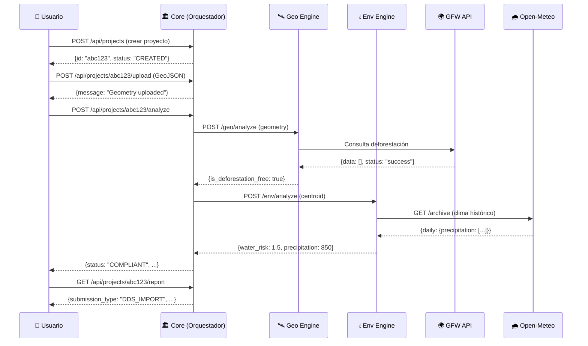

# 🥑 GreenPass Backend - Arquitectura y Documentación

Este documento explica la arquitectura del backend de GreenPass, cómo está organizado el código, y cómo interactúan los diferentes componentes.

---

## 📋 Tabla de Contenidos

1. [Visión General](#visión-general)
2. [Estructura de Carpetas](#estructura-de-carpetas)
3. [La Triada: Los 3 Módulos](#la-triada-los-3-módulos)
4. [Flujo de Datos](#flujo-de-datos)
5. [APIs Externas](#apis-externas)
6. [Modelos de Datos (Pydantic)](#modelos-de-datos-pydantic)
7. [Diagrama de Secuencia](#diagrama-de-secuencia)

---

## Visión General

GreenPass es una API para verificar el cumplimiento de la regulación **EUDR** (European Union Deforestation Regulation). El sistema:

1. Recibe un **polígono GeoJSON** con la ubicación de una parcela agrícola
2. Verifica que **no haya deforestación** después del 31 de diciembre de 2020
3. Analiza **riesgo hídrico** y condiciones **climáticas**
4. Genera un **reporte JSON** compatible con TRACES NT (sistema de la UE)

```
┌─────────────┐     ┌─────────────┐     ┌─────────────┐
│   Frontend  │────▶│   Backend   │────▶│  TRACES NT  │
│  (GeoJSON)  │     │  (FastAPI)  │     │  (EU System)│
└─────────────┘     └─────────────┘     └─────────────┘
                           │
                    ┌──────┴──────┐
                    ▼             ▼
              ┌──────────┐  ┌──────────┐
              │ GFW API  │  │Open-Meteo│
              │Climatiq  │  │ Aqueduct │
              └──────────┘  └──────────┘
```

---

## Estructura de Carpetas

```
src/
├── main.py              # 🚀 Punto de entrada FastAPI
├── config.py            # ⚙️ Configuración (env vars)
│
├── core/                # 🏛️ MÓDULO 1: Orquestador
│   ├── router.py        # Endpoints públicos (/api/...)
│   ├── service.py       # Lógica de negocio
│   └── schemas/         # Modelos de entrada/salida
│       ├── requests.py  # ProjectCreate, etc.
│       └── responses.py # AnalysisResult, EUDRReport
│
├── geo/                 # 🛰️ MÓDULO 2: Motor Geoespacial
│   ├── router.py        # Endpoints internos (/geo/...)
│   ├── service.py       # Validación de geometría
│   └── clients/
│       └── gfw_client.py # Cliente Global Forest Watch
│
├── env/                 # 💧 MÓDULO 3: Motor Ambiental
│   ├── router.py        # Endpoints internos (/env/...)
│   ├── service.py       # Análisis agua/clima/carbono
│   └── clients/
│       ├── openmeteo_client.py  # Clima histórico
│       ├── climatiq_client.py   # Huella de carbono
│       └── aqueduct_client.py   # Riesgo hídrico (mock)
│
├── shared/              # 🔧 Código compartido
│   ├── geometry.py      # Utilidades Shapely
│   ├── http_client.py   # Cliente HTTP base
│   ├── exceptions.py    # Excepciones custom
│   └── models/
│       └── geojson.py   # Modelos GeoJSON Pydantic
│
└── db/                  # 🗄️ Base de datos
    └── session.py       # Configuración SQLAlchemy
```

---

## La Triada: Los 3 Módulos

El backend sigue un patrón de **3 módulos especializados** (llamado "La Triada"):

### 🏛️ Módulo 1: Core (Orquestador)

**Ubicación:** `src/core/`

**Responsabilidad:** 
- Expone los endpoints públicos que consume el frontend
- Orquesta las llamadas a los otros 2 módulos
- Genera el reporte final EUDR

**Endpoints:**
| Método | Path | Descripción |
|--------|------|-------------|
| POST | `/api/projects` | Crear proyecto |
| GET | `/api/projects` | Listar proyectos |
| POST | `/api/projects/{id}/upload` | Subir GeoJSON |
| POST | `/api/projects/{id}/analyze` | Ejecutar análisis |
| GET | `/api/projects/{id}/report` | Obtener reporte EUDR |

**Archivos clave:**
- `router.py` - Define los endpoints con FastAPI
- `service.py` - Contiene la lógica de negocio (CoreService)
- `schemas/responses.py` - Define la estructura del reporte EUDR

---

### 🛰️ Módulo 2: Geo (Motor Geoespacial)

**Ubicación:** `src/geo/`

**Responsabilidad:**
- Valida geometrías GeoJSON (polígonos cerrados, sin auto-intersección)
- Calcula área en hectáreas y centroide
- Consulta Global Forest Watch para detectar deforestación

**Endpoints internos:**
| Método | Path | Descripción |
|--------|------|-------------|
| POST | `/geo/analyze` | Análisis completo (geometría + deforestación) |
| POST | `/geo/validate` | Solo validar geometría |

**Archivos clave:**
- `service.py` - GeoService con lógica de validación
- `clients/gfw_client.py` - Cliente para API de Global Forest Watch
- `schemas/responses.py` - GeoAnalysisResponse

**Dependencias externas:**
- **Shapely** - Manipulación de geometrías
- **PyProj** - Cálculo de áreas geodésicas
- **Global Forest Watch API** - Datos de deforestación

---

### 💧 Módulo 3: Env (Motor Ambiental)

**Ubicación:** `src/env/`

**Responsabilidad:**
- Evalúa riesgo hídrico (WRI Aqueduct)
- Obtiene datos climáticos históricos (Open-Meteo)
- Calcula huella de carbono si hay deforestación (Climatiq)

**Endpoints internos:**
| Método | Path | Descripción |
|--------|------|-------------|
| POST | `/env/analyze` | Análisis completo (agua + clima + carbono) |
| GET | `/env/water-risk` | Solo riesgo hídrico |
| GET | `/env/climate` | Solo datos climáticos |

**Archivos clave:**
- `service.py` - EnvService con lógica ambiental
- `clients/openmeteo_client.py` - Clima histórico (gratis, sin API key)
- `clients/climatiq_client.py` - Cálculo CO2e (requiere API key)
- `clients/aqueduct_client.py` - Riesgo hídrico (mock para hackathon)

---

## Flujo de Datos

Este es el flujo completo cuando un usuario sube una parcela y solicita análisis:

```
┌──────────────────────────────────────────────────────────────────┐
│                        FLUJO DE ANÁLISIS                         │
└──────────────────────────────────────────────────────────────────┘

1️⃣ Usuario sube GeoJSON
   │
   ▼
┌─────────────────────────────────────────────────────────────────┐
│  CORE (Orquestador)                                             │
│  POST /api/projects/{id}/analyze                                │
│                                                                 │
│  CoreService.run_analysis()                                     │
│    ├─▶ Obtiene geometría guardada                               │
│    │                                                            │
│    ├─▶ Llama a GEO ─────────────────────────────────────────┐   │
│    │                                                        │   │
│    │   ┌────────────────────────────────────────────────┐   │   │
│    │   │  GEO (Motor Geoespacial)                       │   │   │
│    │   │  POST /geo/analyze                             │   │   │
│    │   │                                                │   │   │
│    │   │  GeoService.analyze()                          │   │   │
│    │   │    ├─▶ validate_and_fix_geometry()             │   │   │
│    │   │    ├─▶ calculate_area_hectares()               │   │   │
│    │   │    ├─▶ calculate_centroid()                    │   │   │
│    │   │    └─▶ GFWClient.check_tree_cover_loss() ──────┼───┼─▶ 🌍 Global Forest Watch API
│    │   │                                                │   │   │
│    │   │  Returns: GeoAnalysisResponse                  │   │   │
│    │   │    - geometry_valid: true                      │   │   │
│    │   │    - area_hectares: 14.25                      │   │   │
│    │   │    - is_deforestation_free: true               │   │   │
│    │   └────────────────────────────────────────────────┘   │   │
│    │                                                        │   │
│    ◀─────────────────────────────────────────────────────────   │
│    │                                                            │
│    ├─▶ Llama a ENV ─────────────────────────────────────────┐   │
│    │                                                        │   │
│    │   ┌────────────────────────────────────────────────┐   │   │
│    │   │  ENV (Motor Ambiental)                         │   │   │
│    │   │  POST /env/analyze                             │   │   │
│    │   │                                                │   │   │
│    │   │  EnvService.analyze()                          │   │   │
│    │   │    ├─▶ AqueductClient.get_water_risk() ────────┼───┼─▶ 💧 WRI Aqueduct (mock)
│    │   │    ├─▶ OpenMeteoClient.get_historical() ───────┼───┼─▶ 🌧️ Open-Meteo API
│    │   │    └─▶ ClimatiqClient.estimate() ──────────────┼───┼─▶ 🌿 Climatiq API
│    │   │                                                │   │   │
│    │   │  Returns: EnvAnalysisResponse                  │   │   │
│    │   │    - water_risk_score: 1.5                     │   │   │
│    │   │    - avg_precipitation: 850mm                  │   │   │
│    │   │    - co2e_tonnes: 0.0                          │   │   │
│    │   └────────────────────────────────────────────────┘   │   │
│    │                                                        │   │
│    ◀─────────────────────────────────────────────────────────   │
│    │                                                            │
│    └─▶ Determina compliance final                               │
│          if (no_deforestation && !veda_zone && water_ok):       │
│              status = "COMPLIANT"                               │
│                                                                 │
└─────────────────────────────────────────────────────────────────┘
   │
   ▼
2️⃣ Retorna AnalysisResultResponse
   │
   ▼
3️⃣ Usuario solicita GET /api/projects/{id}/report
   │
   ▼
4️⃣ Se genera EUDRPayload (JSON para TRACES NT)
```

---

## APIs Externas

### 🛰️ Global Forest Watch (GFW)

**URL Base:** `https://data-api.globalforestwatch.org`

**Propósito:** Detectar pérdida de cobertura forestal

**Cómo funciona:**
1. Creamos un "geostore" con el polígono: `POST /geostore/`
2. Consultamos pérdida de árboles: `GET /dataset/umd_tree_cover_loss/latest/query/json`

**Cliente:** `src/geo/clients/gfw_client.py`

---

### 🌧️ Open-Meteo

**URL Base:** `https://archive-api.open-meteo.com/v1/archive`

**Propósito:** Datos históricos de clima (precipitación, temperatura)

**Ventaja:** Gratis, no requiere API key

**Cliente:** `src/env/clients/openmeteo_client.py`

---

### 🌿 Climatiq

**URL Base:** `https://api.climatiq.io/data/v1`

**Propósito:** Calcular emisiones de CO2e por cambio de uso de suelo

**Requiere:** API key (configurar en `.env`)

**Cliente:** `src/env/clients/climatiq_client.py`

---

### 💧 WRI Aqueduct

**Propósito:** Evaluar riesgo hídrico

**Estado:** Mock para hackathon (datos simulados de zonas de Michoacán)

**Cliente:** `src/env/clients/aqueduct_client.py`

---

## Modelos de Datos (Pydantic)

### Entrada del Usuario

```python
# src/core/schemas/requests.py
class ProjectCreate(BaseModel):
    name: str                    # "Huerta San Miguel"
    organization_name: str       # "Avocados MX S.A."
    organization_eori: str       # "MX123456789012"
    commodity_code: str          # "08044000" (aguacates)
    destination_market: str      # "NL" (Países Bajos)
```

### Resultado del Análisis

```python
# src/core/schemas/responses.py
class AnalysisResultResponse(BaseModel):
    project_id: str
    status: Literal["COMPLIANT", "NON_COMPLIANT", "ERROR"]
    compliance_summary: str
    area_hectares: float
    geometry_valid: bool
    deforestation: DeforestationResult
    water: WaterResult
    climate: ClimateResult
    carbon: CarbonResult
    analyzed_at: datetime
```

### Reporte EUDR (para TRACES NT)

```python
# src/core/schemas/responses.py
class EUDRReportResponse(BaseModel):
    submission_type: str         # "DDS_IMPORT"
    version: str                 # "2.1"
    header: dict                 # Operador, referencia
    commodity: dict              # Producto, cantidad
    geolocation: dict            # GeoJSON de la parcela
    compliance: dict             # Verificación EUDR
    greenpass_reference: str     # "GP-2026-MX-27389"
```

---

## Diagrama de Secuencia



---

## Cómo Ejecutar

```bash
# 1. Activar entorno virtual
cd /home/pillofon/Documents/Proyectos/STARTHackathon
source venv/bin/activate

# 2. Iniciar servidor
uvicorn src.main:app --reload --port 8000

# 3. Ver documentación
open http://localhost:8000/docs
```

---

## Próximos Pasos

1. **Conectar frontend** - El equipo de frontend puede consumir `/api/projects`
2. **Base de datos** - Cambiar almacenamiento en memoria por PostGIS
3. **API Keys** - Configurar `CLIMATIQ_API_KEY` en `.env`
4. **Tests E2E** - Ejecutar `pytest tests/ -v`
